<div align="center">

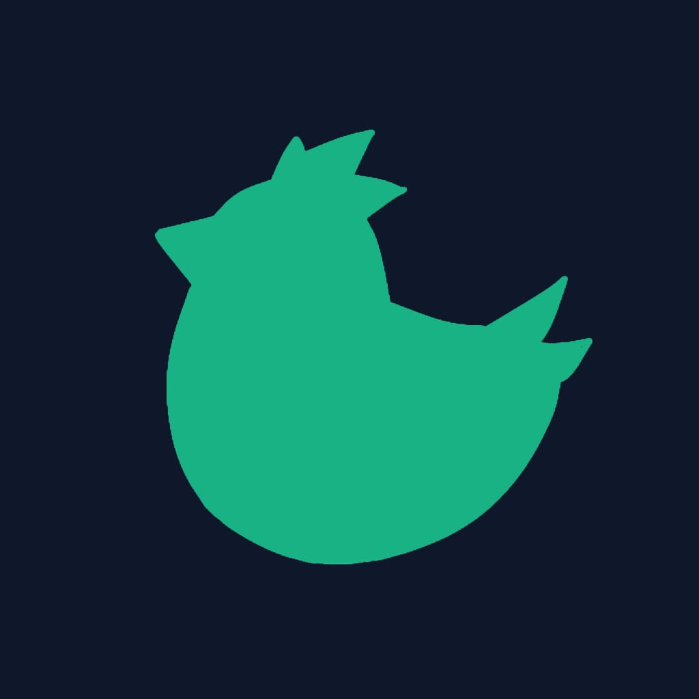

# ChikGuard

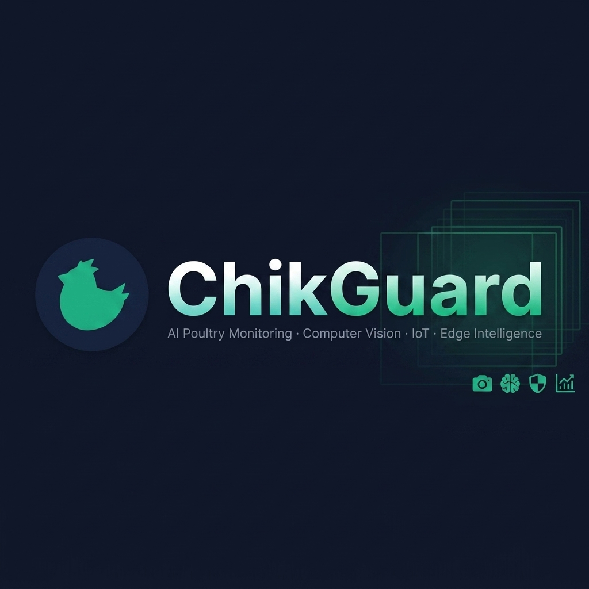

**AI-powered poultry monitoring system with real-time computer vision, IoT sensor integration, and edge intelligence.**

[](https://github.com/Nicolas125-tech/ChikGuard-Original/actions/workflows/ci.yml)
[](./LICENSE)
[](https://python.org)
[](https://react.dev)
[](https://expo.dev)
[](./docker-compose.yml)
[](https://supabase.com)

</div>

---

## 🧠 What is ChikGuard?

ChikGuard is a full-stack intelligent monitoring platform for commercial poultry farms. It combines **YOLOv8-based computer vision**, **real-time WebRTC video streaming**, **IoT sensor fusion** (temperature, humidity, ammonia), and **autonomous FSM-driven actuator control** to reduce flock mortality and improve biosecurity compliance.

| Layer | Stack |
|---|---|
| **Backend** | Python 3.12, Flask, Flask-SocketIO, aiortc, SQLAlchemy |
| **Vision AI** | YOLOv8 (ONNX), OpenCV, custom tracking pipeline |
| **Frontend** | React 18, Vite, TailwindCSS, Recharts |
| **Mobile** | React Native (Expo) |
| **Database** | Supabase (PostgreSQL) + local SQLite fallback |
| **Infra** | Docker Compose, Cloudflare Tunnel, mTLS |

---

## ✨ Features

- 🎥 **Live video streaming** via WebRTC with per-camera AI inference
- 🐔 **Bird counting & behavior analysis** in real time
- 🌡️ **Sensor fusion** — temperature, humidity, ammonia, acoustic anomaly detection
- 🤖 **Autonomous FSM** — actuator control (ventilation, heating) without human input
- 📊 **ESG compliance reports** (PDF generation with ReportLab)
- 🔐 **RBAC + JWT auth** with Supabase Auth and OAuth providers
- 📱 **Mobile app** for remote farm monitoring
- 🧩 **Plugin system** — extend with custom AI modules (fire detection, disease detection, etc.)
- 🦆 **Lameness Detection (Pose Estimation)** — advanced geometric and stride analysis for early lameness alerts using YOLOv8-Pose and MQTT.
- 🌐 **Edge-ready** — runs locally with Cloudflare Tunnel for secure remote access

---

## 🏗️ Architecture

```
ChikGuard/
├── backend/              # Python/Flask API + AI pipeline
│   ├── app.py            # Main entrypoint
│   ├── database.py       # ORM models (SQLAlchemy)
│   ├── src/
│   │   ├── api/          # REST endpoints (auth, sensors, devices, reports, WebRTC)
│   │   ├── core/         # Config, logger, state machine (FSM)
│   │   ├── vision/       # CV inference pipeline
│   │   ├── cv_master/    # Orchestration layer
│   │   ├── agents/       # Autonomous AI agents
│   │   ├── alerts/       # Push notification providers
│   │   ├── audio/        # Acoustic anomaly detection
│   │   ├── mlops/        # Model versioning & management
│   │   ├── reports/      # PDF report generation
│   │   ├── security/     # Auth middleware, hardening, mTLS
│   │   └── plugins/      # Plugin base & manager
│   ├── plugins/          # Pluggable AI modules
│   ├── scripts/          # Utility & pipeline scripts
│   ├── models/           # ML model weights (see models/README.md)
│   └── tests/            # Pytest test suite
├── frontend/             # React + Vite dashboard
├── mobile/               # Expo React Native app
├── docs/                 # Architecture docs & screenshots
├── scripts/              # DevOps & infra scripts
│   └── simulators/       # Data & video simulators
└── supabase/
    └── migrations/       # Database migrations
```

---

## 🚀 Quick Start

### Prerequisites

- Python 3.12+
- Node.js 18+ & npm
- Docker & Docker Compose *(recommended)*
- A [Supabase](https://supabase.com) project

### 1. Clone & configure

```bash
git clone https://github.com/Nicolas125-tech/ChikGuard-Original.git
cd ChikGuard
cp .env.example .env
# Edit .env with your credentials
```

### 2. Download AI Models

See [`backend/models/README.md`](backend/models/README.md) for instructions to download the required YOLOv8 model weights.

### 3. Run with Docker (recommended)

```bash
docker-compose up --build
```

- **Backend API:** `http://localhost:5000`
- **Frontend:** `http://localhost:5173`

### 4. Run locally (development)

**Backend:**
```bash
cd backend
python -m venv venv
# Windows: venv\Scripts\activate | Linux/macOS: source venv/bin/activate
pip install -r requirements.txt
PYTHONPATH=. python app.py
```

**Frontend:**
```bash
cd frontend
npm install
npm run dev
```

**Mobile:**
```bash
cd mobile
npm install
npm start
```

### 5. Running the Edge Lameness Detection Pipeline (Enterprise Edition)
To run the specialized Edge inference pipeline with the advanced **Hock Angle Gait Analysis** and MQTT integration:

**How it works (Business Rules):**
The pipeline calculates the exact Tibiotarsal (Hock) Angle dynamically. An event is triggered and sent to MQTT if:
- **Average Angle < 60°** (indicates the bird is crouched or refusing to stand).
- **Angle Variance < 5.0** (indicates a locked or stiff leg over the temporal window).

```bash
cd backend
# Make sure you have a local MQTT broker installed and running (e.g., Mosquitto)
# Install paho-mqtt if not present: pip install paho-mqtt
python scripts/run_lameness_edge.py
```

---

## 🔌 Plugin System

ChikGuard supports pluggable AI modules. Each plugin lives in `backend/plugins/<name>/plugin.py`:

```python
from src.plugins.base import PluginBase, PluginInfo

class FireDetectionPlugin(PluginBase):
    info = PluginInfo(name="fire_detection", version="1.0.0", description="Detects fire in video frames")

def register():
    return FireDetectionPlugin()
```

### 🛂 Biosafety Audit Plugin (Heimdall)
The **Biosafety Audit Plugin** monitors compliance of mandatory Personal Protective Equipment (EPIs) and audits vehicle presence in critical perimeter cameras (`ENTRANCE` and `SANITARY_BARRIER` zones).

* **How it works:**
  - Runs pure inference using a custom YOLOv8 model (`yolov8n-epi.engine`) without overhead on bird-tracking pipelines.
  - Automatically targets only restricted entry zones (`ENTRANCE` or `SANITARY_BARRIER`).
  - Matches detected people with required EPI categories (e.g. `helmet`, `vest`, `boots`) through bounding box containment/overlap analysis.
  - Generates JSON event logs with `CRITICAL` severity to the database if any requirement is violated.

* **Configuration (via context settings):**
  - `BIOSAFETY_MODEL_PATH`: Path to the custom trained YOLOv8 weight file.
  - `BIOSAFETY_REQUIRED_EPIS`: List of mandatory items to monitor (e.g. `["helmet", "vest", "boots"]`).

* **Running tests:**
  ```bash
  cd backend
  .venv\Scripts\pytest tests/plugins/
  ```

---

## 📡 Key API Endpoints

| Method | Endpoint | Description |
|--------|----------|-------------|
| `GET` | `/api/summary` | Real-time system summary (CV + Sensors) |
| `GET` | `/api/sensors/live` | Live sensor readings |
| `POST` | `/api/auto-mode` | Update FSM automation rules |
| `POST` | `/api/ventilacao` | Turn ventilation on/off (Manual Control) |
| `POST` | `/api/aquecedor` | Turn heater on/off (Manual Control) |
| `GET` | `/api/estado-dispositivos` | Get current state of devices |
| `GET` | `/api/history` | Historical sensor data for charts |
| `POST` | `/api/webrtc/offer` | WebRTC video stream handshake |
| `POST` | `/api/reports/esg` | Generate ESG compliance PDF |
| `GET` | `/api/accounts/me` | Authenticated user details (RBAC) |

---

## 📸 Screenshots

<details>
<summary><b>🖥️ Web Dashboard</b> (click to expand)</summary>

| Landing | Login | Admin Dashboard |
|---|---|---|
| 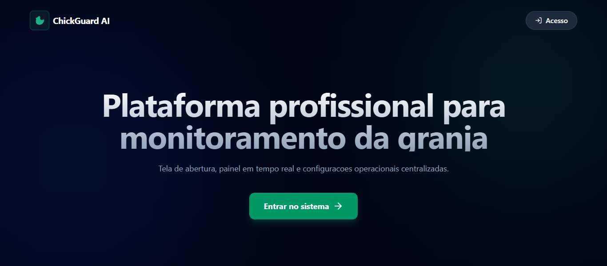 | 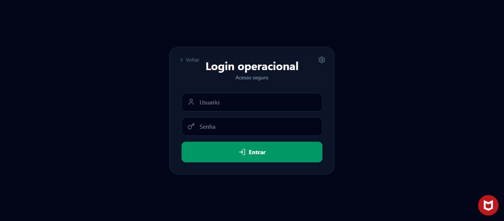 | 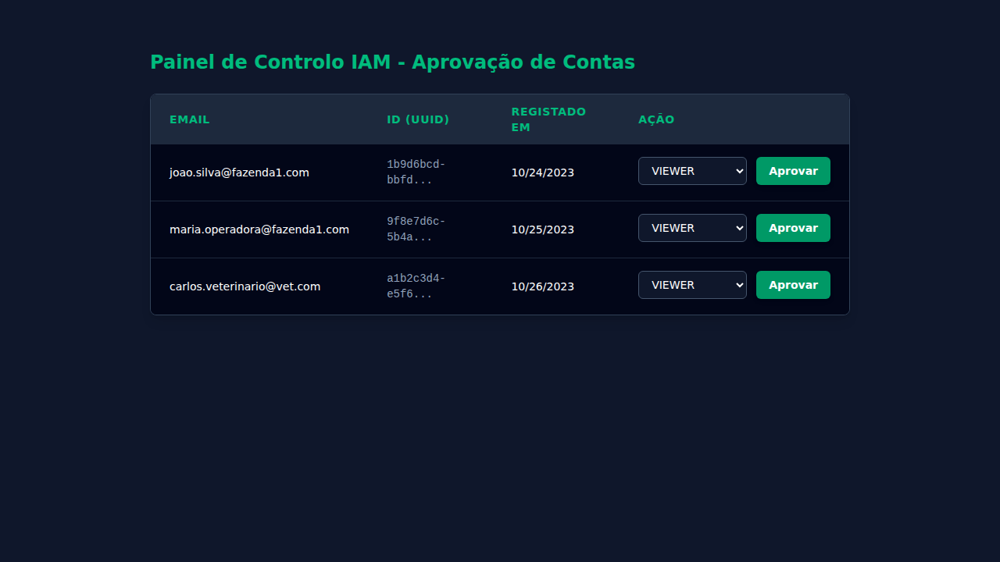 |

| Overview | Birds | History |
|---|---|---|
| 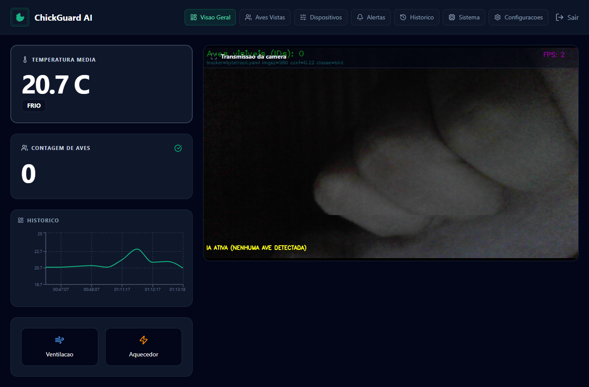 | 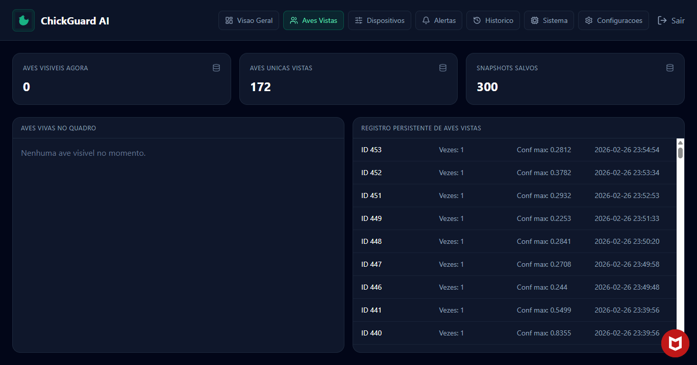 | 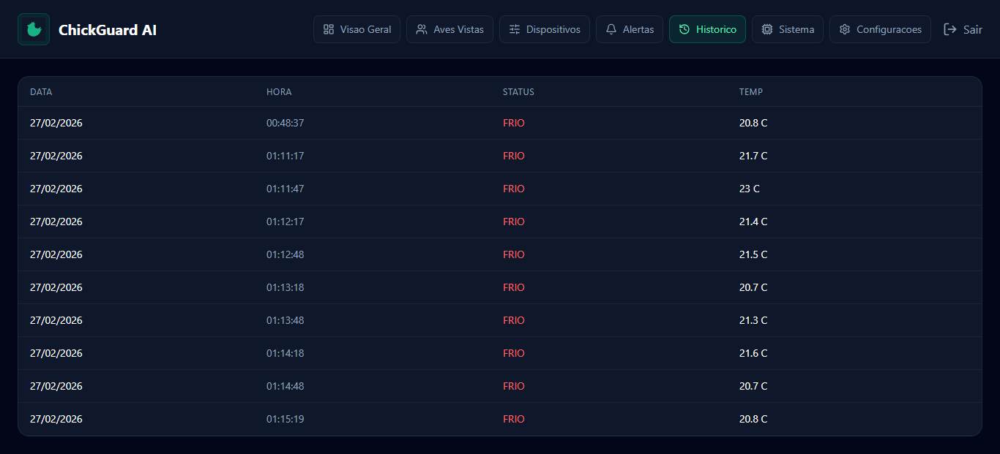 |

| Devices | Settings | System |
|---|---|---|
| 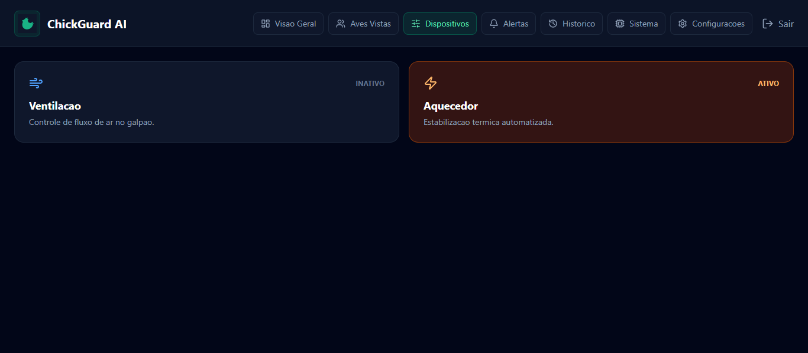 | 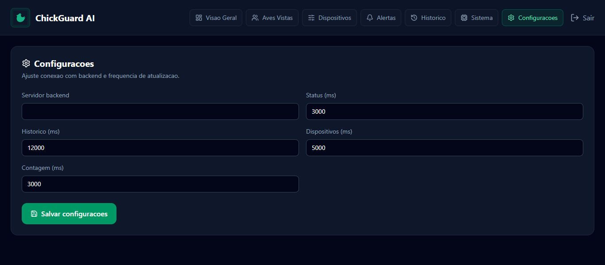 | 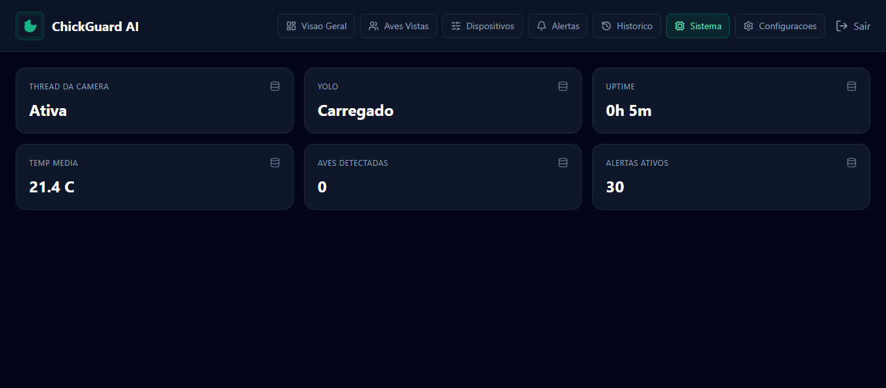 |

</details>

<details>
<summary><b>📱 Mobile App</b> (click to expand)</summary>

| Login | Monitor | Birds |
|---|---|---|
| 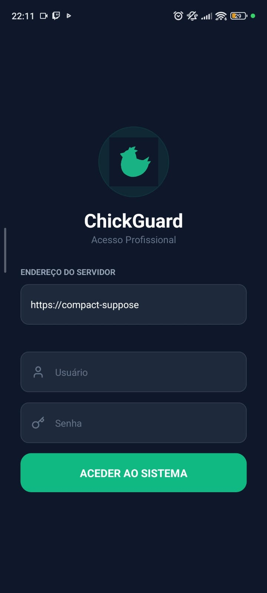 | 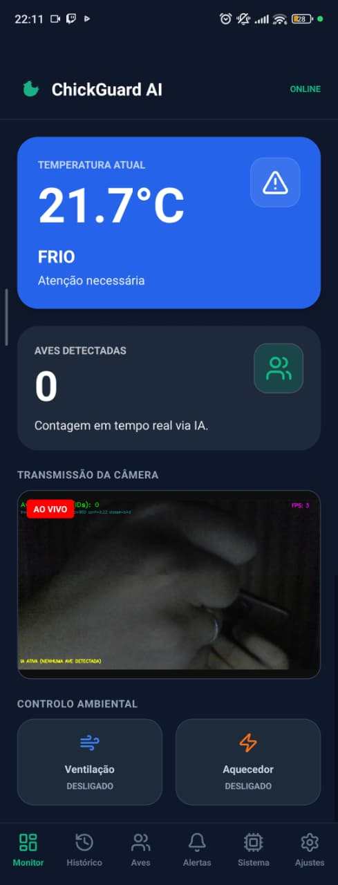 | 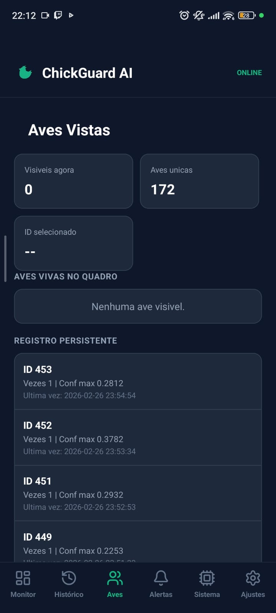 |

| Alerts | History | Settings |
|---|---|---|
| 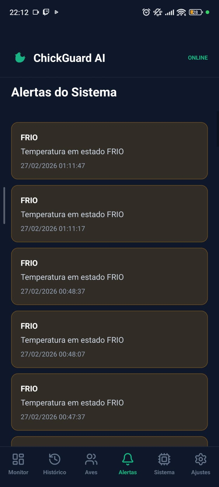 | 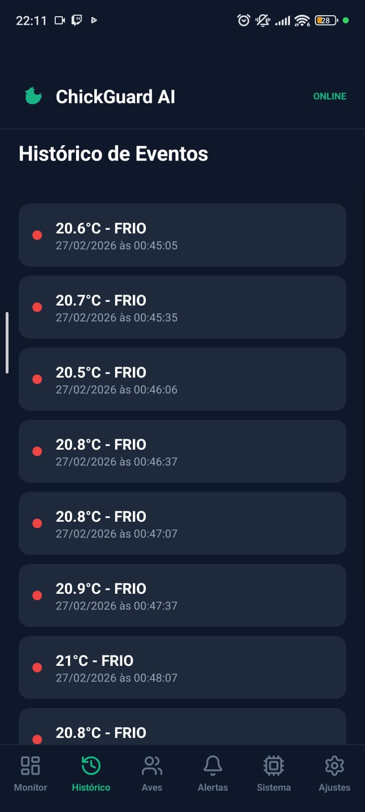 | 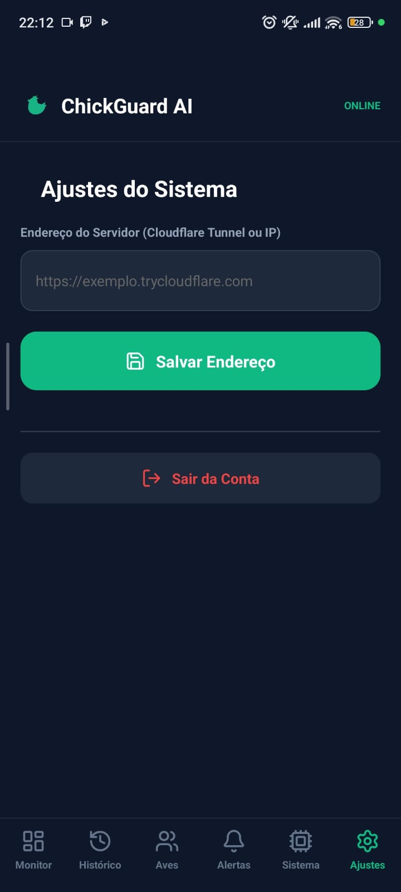 |

| System | | |
|---|---|---|
| 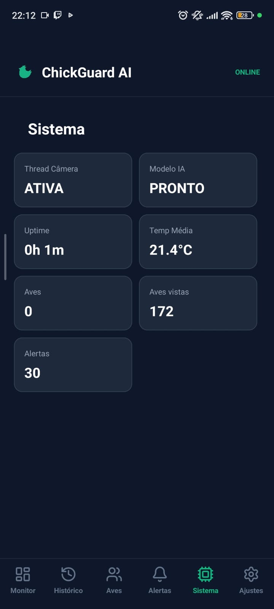 | | |

</details>

---

## 📄 Documentation

| Document | Description |
|---|---|
| [Edge Security Architecture](docs/EDGE_SECURITY_ARCHITECTURE.md) | mTLS, Cloudflare Tunnel, edge hardening |
| [IAM & Supabase Proposal](docs/IAM_SUPABASE_PROPOSAL.md) | Identity & access management design |
| [Linux Setup (CV)](docs/LINUX_SETUP_CV.md) | Setting up computer vision on Linux |
| [Windows Setup (CV)](docs/WINDOWS_SETUP_CV.md) | Setting up computer vision on Windows |

---

## 🤝 Contributing

Contributions are welcome! Please read [CONTRIBUTING.md](CONTRIBUTING.md) before submitting a pull request.

---

## 📝 License

This project is licensed under the MIT License — see the [LICENSE](LICENSE) file for details.
